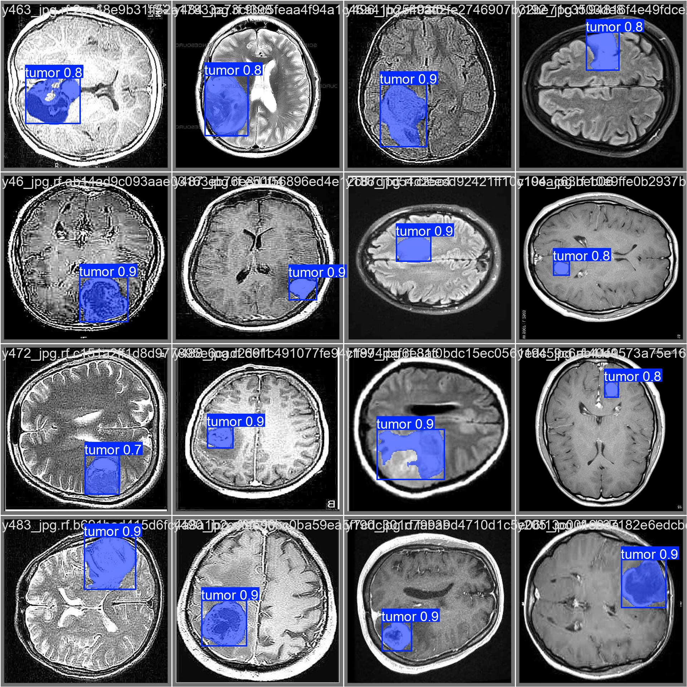

# Brain Tumor Segmentation using YOLOv11

## Overview
This project utilizes the YOLOv11 model for segmentation tasks, specifically aimed at detecting and segmenting brain tumors in medical images. YOLOv11, an advanced version of the YOLO architecture, offers precise and efficient segmentation capabilities, making it a suitable choice for this challenging application.

---

## Features
- **Efficient Segmentation**: Leverages YOLOv11's advanced architecture for high accuracy.
- **Custom Dataset**: Trained and validated on a specialized dataset of brain tumor images.
- **End-to-End Pipeline**: Includes data preprocessing, model training, validation, and testing.

---

## Dataset
- **Link**: https://universe.roboflow.com/gazi-2anqt/brain-tumor-yzzav-ym6wa/dataset/1

---

## Installation
1. Clone the repository:
   ```bash
   git clone https://github.com/yourusername/brain-tumor-segmentation.git
   cd brain-tumor-segmentation
   ```
   
2. Download the dataset and place it in the `data/` directory.

---

## Results


- **Precision**: 90.2%
---

## Contributing
Contributions are welcome! Please fork the repository and submit a pull request for review.

# Beyin Tümörü Segmentasyonu YOLOv11 Kullanılarak

## Genel Bakış
Bu proje, YOLOv11 modelini segmentasyon görevleri için kullanarak tıbbi görüntülerde beyin tümörlerini tespit ve segment etmeyi amaçlamaktadır. YOLO mimarisinin geliştirilmiş bir sürümü olan YOLOv11, bu zorlu uygulama için yüksek hassasiyet ve verimlilik sunar.

---

## Özellikler
- **Etkili Segmentasyon**: Yüksek doğruluk için YOLOv11'in gelişmiş mimarisi.
- **Özel Veri Seti**: Beyin tümörü görüntülerinden oluşan özel bir veri seti üzerinde eğitildi ve doğrulandı.
- **Uçtan Uca İşlem**: Veri ön işleme, model eğitimi, doğrulama ve test aşamalarını içerir.

---

## Veri Seti
- **Bağlantı**: https://universe.roboflow.com/gazi-2anqt/brain-tumor-yzzav-ym6wa/dataset/1

---

## Kurulum
1. Depoyu klonlayın:
   ```bash
   git clone https://github.com/yourusername/brain-tumor-segmentation.git
   cd brain-tumor-segmentation
   ```
   
2. Veri setini indirip `data/` dizinine yerleştirin.

---

## Sonuçlar


- **Hassasiyet**: %90.2

---

## Katkıda Bulunma
Katkılar memnuniyetle karşılanır! Lütfen projeyi fork ederek inceleme için bir pull request gönderin.
